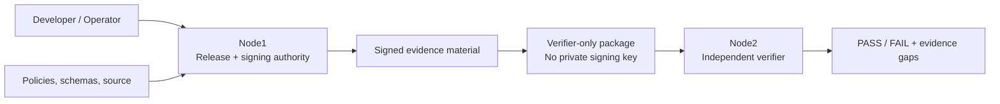

# Portable Agentic AI Governance

Portable Agentic AI Governance is a deterministic security, governance, regulatory-evidence, and bounded-agent control plane for AI/ML, RAG, GenAI, and agentic systems.

The project is intentionally framework-neutral. An LLM or orchestration framework may propose, summarize, or reason, but it does not replace deterministic authorization, policy, signed evidence, replay protection, bounded execution, human approval, or release verification.

## Current release

| Item | Value |
|---|---|
| Current milestone | **M21 — Embedded Linux & Platform Security Validation** |
| Current release | **v0.21.1** |
| Git tag | `m21-embedded-linux-platform-security-v0.21.1` |
| Release commit | `e83ebf03c6d1ce2f4076ab8e3dae8282e4aeb880` |
| M20 frozen baseline | `8b800814e576bcb08e12dc47c1039c5251c79d46` |
| Package version | `0.21.1` |

M21 v0.21.1 corrects the source-binding model introduced in v0.21.0 by separating the immutable M20 baseline from the M21 source revision that generated the signed evidence.

## What problem does this project solve?

AI governance often fails when policy documents are disconnected from executable controls and evidence. This repository turns governance and security requirements into deterministic, testable control paths with signed artifacts and explicit authority boundaries.

The implementation provides, across M0–M21:

- deterministic trust-kernel primitives;
- identity, RBAC/ABAC, mTLS, request signing, anti-replay, protected secrets, rate limiting, and signed audit;
- software/model supply-chain manifests and vulnerability policy;
- model governance, data provenance, retrieval authorization, embedding policy, AI evaluation, and threat modeling;
- risk, privacy, exception, third-party, and continuous-control evidence;
- bounded read-only, tool-using, approval-controlled, and supervised multi-agent workflows;
- security-operations, containment, recovery, and evidence preservation;
- CRA-oriented product-security, vulnerability, incident, reporting, PSIRT/CVD, update, Annex-I, Annex-VII, production-validation, and release-freeze evidence;
- embedded Linux/platform-security evidence for boot chains, TPM/PCRs, firmware signing/rollback, debug controls, least privilege, MAC capability, and CI/CD gates.

## Node1 and Node2

The repository uses a deliberate two-node trust model.



**Node1** is the release/signing authority. It may generate signed milestone material and retain private signing material locally.

**Node2** is an independent verifier. It receives verifier-only material and must reject private signing keys. Node2 proves that release evidence can be validated without inheriting Node1 signing authority.

The terms describe trust roles, not a requirement that every deployment use these exact physical machines.

## What has been validated?

The repository contains deterministic local tests, milestone-specific verification, full regression paths, and cross-node verification.

For the validated M21 v0.21.1 LIVE evidence currently preserved with this source snapshot:

- validation mode: `LIVE`;
- required checks passed: **15**;
- open required checks: **2**;
- `production_ready=false`;
- `cra_conformity_claim=false`.

The two open platform-hardening gaps are intentionally visible:

1. `secure-boot-enabled` — Secure Boot is not enabled on the validated Node1/Node2 baseline.
2. `mac-enforcing` — Node2 does not currently have an enforcing MAC baseline; SELinux remains disabled after the attempted permissive configuration caused a boot failure on that validated Jetson baseline.

A successful verifier run is therefore **not** the same thing as claiming the platform is fully production-hardened.

## Reproduce the current release

The detailed operator procedure lives in [`instruction.md`](instruction.md). The shortest release-oriented path is:

```bash
git clone git@github.com:studioraga/portable-agentic-ai-governance.git
cd portable-agentic-ai-governance
git checkout m21-embedded-linux-platform-security-v0.21.1

export PYTHONPATH="$PWD/src${PYTHONPATH:+:$PYTHONPATH}"
python3 -m pytest -q tests/platform_security
./scripts/m21/validate_m21_local.sh
./scripts/m21/ci_validate.sh
./scripts/m21/validate_m21_regression.sh
```

The local M21 validation uses deterministic fixture profiles. LIVE Node1/Node2 reproduction requires the platform-profile capture and signing/verifier workflow documented in [`docs/Deployment-M21.md`](docs/Deployment-M21.md) and [`docs/Validation-M21.md`](docs/Validation-M21.md).

## Documentation map

| Need | Start here |
|---|---|
| Understand the project | `README.md` |
| Execute developer/operator workflow | [`instruction.md`](instruction.md) |
| Understand durable architecture | [`docs/Architecture.md`](docs/Architecture.md) |
| Understand validation layers | [`docs/Validation.md`](docs/Validation.md) |
| Understand deployment progression | [`docs/oneshot-deployment.md`](docs/oneshot-deployment.md) |
| Check common prerequisites | [`docs/Prerequisites.md`](docs/Prerequisites.md) |
| See M0–M21 evolution | [`docs/Milestones.md`](docs/Milestones.md) |
| Understand current M21 design | [`docs/M21-Embedded-Linux-Platform-Security-Validation.md`](docs/M21-Embedded-Linux-Platform-Security-Validation.md) |
| Execute M21 validation | [`docs/Validation-M21.md`](docs/Validation-M21.md) |
| Execute M21 deployment | [`docs/Deployment-M21.md`](docs/Deployment-M21.md) |

A complete documentation index is in [`docs/README.md`](docs/README.md).

## Authority and safety boundaries

The project deliberately fails closed around authority:

- an LLM is not an authorization boundary;
- agents cannot accept risk or certify compliance;
- private release signing keys must not be transferred to verifier-only nodes;
- signed approvals are separate from request and evidence signing domains;
- destructive platform operations are outside M21 acceptance;
- M21 does not burn fuses, enroll UEFI keys, flash firmware, or install MAC policy;
- generated CRA-oriented evidence is not a CRA conformity assessment or conformity claim.

## Repository layout

```text
portable-agentic-ai-governance/
├── src/            # deterministic runtime/control implementations
├── governance/     # control, CRA, and platform policy material
├── schemas/        # machine-readable contracts
├── agents/         # signed/static agent definitions
├── scripts/        # validation, build, verification, and evidence workflows
├── deploy/         # milestone-scoped deployment helpers
├── tests/          # positive/negative and regression tests
├── examples/       # bounded examples and reference policy material
├── docs/           # architecture, validation, deployment, milestone documentation
├── README.md       # human orientation
└── instruction.md  # authoritative developer/operator workflow
```

## Release philosophy

A milestone is not complete because a document says it is complete. Release evidence must be executable, reproducible, fail closed where required, and preserve the Node1/Node2 authority boundary.


## M22 enterprise-security extension

M22 extends the frozen M21.1 baseline with the authoritative CISSP-domain / enterprise-security control foundation. See `docs/M22-CISSP-Enterprise-Security-Control-Foundation.md`, `docs/Prerequisites-M22.md`, `docs/Deployment-M22.md`, and `docs/Validation-M22.md`. M0–M21 historical behavior remains unchanged; M22 records alignment and gaps and does not assert CISSP, ISO/IEC 27001, ISO/IEC 42001, or CRA certification/conformity.

## M23 relationship

M23 extends the frozen M22 enterprise-security foundation with enterprise human identity, OIDC federation evidence, strong MFA context, phishing-resistant privileged authentication, expiring entitlement review, signed single-use JIT privilege grants, dual-approved break-glass access, segregation of duties, and independent Node1/Node2 verification. The authoritative M23 documents are `docs/M23-Enterprise-Identity-MFA-PAM.md`, `docs/Prerequisites-M23.md`, `docs/Deployment-M23.md`, and `docs/Validation-M23.md`. Historical M0-M22 behavior and evidence remain immutable.
