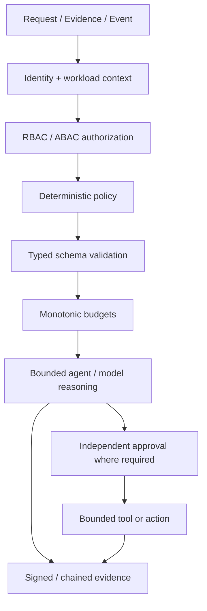
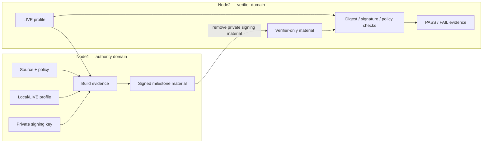
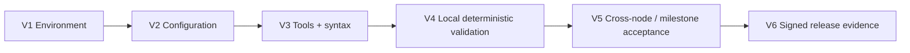

# Architecture

This document describes the architecture that remains true across milestones. Milestone-specific feature details live in the corresponding `docs/M*-*.md` files.

## 1. Architectural principle

The repository separates **reasoning** from **authority**.

Models and agents may analyze bounded inputs and produce proposals. Deterministic code remains responsible for identity, authorization, policy, budgets, schema validation, cryptographic verification, replay protection, signed evidence, approval, and release gates.



An LLM is therefore never the final authorization boundary.

## 2. Major architectural layers

### Trust kernel

`src/portable_ai_governance/kernel/`

Provides deterministic state transitions, authorization interfaces, budgets, signed approval primitives, artifact verification, replay protection, request signing, security-profile handling, and evidence primitives.

### Security control plane

`src/portable_ai_governance/security/`

Adds workload identity, protected secrets, cryptographic services, TLS/mTLS transport, security audit, rate limiting, policy adapters, and runtime security composition.

### Supply-chain and AI-system security

- `src/portable_ai_governance/supply_chain/`
- `src/portable_ai_governance/ai_security/`

These layers bind software, models, prompts, tools, provenance, vulnerability policy, model governance, data provenance, retrieval authorization, embedding controls, evaluation, and threat modeling to deterministic evidence.

### Governance and bounded agents

- `src/portable_ai_governance/agents/`
- `src/portable_ai_governance/evidence_analyst/`
- `src/portable_ai_governance/tool_agent/`
- `src/portable_ai_governance/action_agent/`
- `src/portable_ai_governance/multi_agent/`

Agent capability expands progressively: read-only analysis, mediated typed tools, independently approved side effects, then supervised multi-agent proposals. Authority remains external to model reasoning.

### Security operations

`src/portable_ai_governance/security_ops/`

Provides deterministic event handling, containment/recovery boundaries, and incident evidence preservation.

### CRA-oriented evidence chain

The CRA modules under `src/portable_ai_governance/cra_*` progressively add requirement mapping, vulnerability/exploitation intelligence, incident clocks, reporting-pack preparation, PSIRT/CVD, secure update/lifecycle, Annex-I evidence, Annex-VII technical-file assembly, Node1/Node2 production validation, and final-freeze evidence.

These modules prepare and verify engineering evidence. They do not themselves perform a CRA conformity assessment or claim conformity.

### Platform security

`src/portable_ai_governance/platform_security/`

M21 adds platform-profile collection and evaluation, synthetic firmware signing and anti-rollback demonstrations, TPM/PCR evidence handling, DICE semantics boundaries, debug-control evidence, boot-chain modeling, MAC capability evidence, and signed platform-security material.

## 3. Node1 / Node2 trust architecture



The important invariant is asymmetric authority: Node1 may sign; Node2 may verify but must not inherit the private signing key.

## 4. Evidence architecture

Machine-readable governance material lives primarily under:

```text
governance/
schemas/
agents/
```

Executable enforcement and verification lives under:

```text
src/
scripts/
deploy/
tests/
```

Generated runtime evidence lives outside tracked source, normally under `var/` or an installed per-user path such as `~/.config/portable-ai-governance/<milestone>`.

A signed milestone package generally contains:

1. policy/control material;
2. captured or deterministic input evidence;
3. generated result/summary material;
4. artifact digests;
5. a signed manifest;
6. a public verification key;
7. no private signing key in verifier-only packages.

## 5. Validation architecture

All milestone validation follows the same general progression:



See [`Validation.md`](Validation.md) for the detailed contract.

## 6. Deployment architecture

Deployment support is intentionally milestone-scoped today. Scripts under `deploy/m*/` package and deploy the material needed for a specific milestone.

The long-term repository-level interface is a progressive contract, not a claim that a universal installer already exists:

```text
./deploy.sh --node1
./deploy.sh --node2
./deploy.sh --all
./deploy.sh --verify
./deploy.sh --rollback
```

See [`oneshot-deployment.md`](oneshot-deployment.md).

## 7. Durable security invariants

Across milestones:

- deny by default where authority is required;
- deterministic policy outranks model output;
- schemas constrain inputs/outputs and handoffs;
- budgets are monotonic and bounded;
- approvals are independent, signed, and replay-protected when side effects are allowed;
- signing domains remain purpose-separated;
- verifier-only nodes do not receive private release signing keys;
- negative tests are release evidence;
- generated artifacts are digest-bound;
- unavailable controls are represented explicitly rather than fabricated as PASS;
- documentation does not create compliance or production-readiness claims.

## 8. Current architecture state

The current tagged release is M21 v0.21.1. It extends the M0–M20 governance/security/evidence architecture into embedded Linux and platform-security validation while preserving all earlier authority boundaries.


## M22 enterprise-security extension

M22 extends the frozen M21.1 baseline with the authoritative CISSP-domain / enterprise-security control foundation. See `docs/M22-CISSP-Enterprise-Security-Control-Foundation.md`, `docs/Prerequisites-M22.md`, `docs/Deployment-M22.md`, and `docs/Validation-M22.md`. M0–M21 historical behavior remains unchanged; M22 records alignment and gaps and does not assert CISSP, ISO/IEC 27001, ISO/IEC 42001, or CRA certification/conformity.


### M22 relationship

This document remains authoritative for its historical milestone scope. M22 does not rewrite that milestone; it inventories and maps its reusable controls/evidence into the enterprise-security foundation and records remaining gaps in `governance/enterprise/m22/gap-register.json`. See `docs/M22-CISSP-Enterprise-Security-Control-Foundation.md`.

## M23 relationship

M23 extends the frozen M22 enterprise-security foundation with enterprise human identity, OIDC federation evidence, strong MFA context, phishing-resistant privileged authentication, expiring entitlement review, signed single-use JIT privilege grants, dual-approved break-glass access, segregation of duties, and independent Node1/Node2 verification. The authoritative M23 documents are `docs/M23-Enterprise-Identity-MFA-PAM.md`, `docs/Prerequisites-M23.md`, `docs/Deployment-M23.md`, and `docs/Validation-M23.md`. Historical M0-M22 behavior and evidence remain immutable.

## M24 relationship

M24 extends the frozen M23 baseline with deterministic asset inventory/ownership/classification, retention and legal-hold handling, evidence-backed sanitization, default-deny DLP/controlled export, and cryptographic key-lifecycle evidence. This historical document remains authoritative for its original milestone; M24 consumes its reusable evidence but does not rewrite M0-M23 semantics. See `docs/M24-Asset-Security-Data-Protection-Crypto-Lifecycle.md`, `docs/Prerequisites-M24.md`, `docs/Deployment-M24.md`, and `docs/Validation-M24.md`. M24 closes only `CISSP-D2-001..003`; M21-dependent Domain-3 platform/hardware-root gaps remain open.

## M25 relationship

M25 extends the frozen M24 baseline with explicit network zones, default-deny micro-segmentation, mTLS workload-identity binding, egress allowlisting, network-detection policy and deterministic firewall evidence. This historical document remains authoritative for its original milestone; M25 consumes reusable evidence without rewriting M0-M24 semantics. See `docs/M25-Zero-Trust-Network-Microsegmentation.md`, `docs/Prerequisites-M25.md`, `docs/Deployment-M25.md`, and `docs/Validation-M25.md`. M25 closes the M22 `CISSP-D4-002` engineering gap while physical switch/VLAN enforcement and M26 SOC/DR integration remain environment/future-scope evidence.
