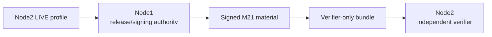

# M21 — Embedded Linux & Platform Security Validation

M21 extends the M0–M20 governance, security, bounded-agent, CRA-evidence, cross-node validation, and final-freeze chain into demonstrable platform-security evidence for Linux/embedded/server-class systems.

## Scope

M21 covers:

- Node1 BIOS/UEFI-oriented boot-chain evidence;
- Jetson-style BootROM → MB1 → MB2 → UEFI boot-chain evidence;
- Secure Boot and kernel-lockdown observation;
- BMC/device-firmware capability/inventory evidence;
- synthetic firmware signing and payload verification;
- monotonic rollback-counter decisions;
- debug-control sysctls;
- Linux least-privilege/systemd isolation reference controls;
- AppArmor/SELinux capability and enforcement evidence;
- TPM device/usability/PCR evidence;
- clearly separated DICE software demonstration vs hardware claim;
- signed platform-security manifest and verifier-only packaging;
- platform threat model and CI gates.

## Safety boundary

M21 acceptance is non-destructive. It does **not**:

- burn fuses;
- enroll UEFI keys;
- flash firmware;
- alter debug fuses;
- install or force-enable MAC policy;
- reconfigure the host merely to satisfy a check;
- claim CRA conformity.

LIVE collectors observe current state. Synthetic firmware is used for signing/rollback demonstrations.

## Node roles



**Node1** captures its LIVE platform profile, combines it with the Node2 profile, generates and signs M21 material, and packages verifier-only evidence.

**Node2** captures its LIVE profile and independently verifies the public/verifier material. Node2 must reject private signing material.

## Boot-chain model

Node1:

```text
hardware / platform firmware
  → UEFI
  → shim / GRUB
  → kernel
  → initramfs
  → root filesystem
  → systemd services
```

Node2:

```text
BootROM / fuses
  → MB1
  → MB2
  → UEFI
  → kernel / DTB / initrd
  → root filesystem
  → systemd services
```

These models describe the validation evidence chain; they do not by themselves prove that Secure Boot is enabled.

## Root-of-trust evidence

TPM collection distinguishes:

- device presence;
- actual tool/device usability;
- PCR readability.

DICE evidence has two distinct meanings:

- `DEMONSTRATION_ONLY` software derivation for semantics/testing;
- explicit hardware capability evidence when a platform can support such a claim.

Software DICE output is never presented as hardware DICE evidence.

## Source and baseline provenance

M21 v0.21.1 signs provenance using separate fields:

| Field | Meaning |
|---|---|
| `m20_baseline_commit` | immutable M20 source baseline |
| `m20_baseline_tag` | immutable M20 release identity |
| `m21_source_commit` | exact M21 source revision used to generate evidence |

This corrects the v0.21.0 ambiguity that compared an M20-named field directly to the current repository HEAD.

## Current validated LIVE result

The preserved M21 v0.21.1 evidence in the reviewed release snapshot reports:

- 15 required checks passed;
- 2 required checks open;
- `production_ready=false`;
- `cra_conformity_claim=false`.

Open checks:

1. **Secure Boot** — not enabled on the validated Node1/Node2 baseline.
2. **Enforcing MAC on Node2** — no enforcing MAC baseline is currently demonstrated. SELinux is intentionally left disabled on the stable validated Jetson baseline after the attempted permissive configuration caused a boot failure.

These are platform-hardening gaps, not reasons to falsify the verifier result.

## Reference implementation paths

```text
src/portable_ai_governance/platform_security/
governance/platform/m21/
schemas/m21/
scripts/m21/
deploy/m21/
examples/m21/
tests/platform_security/
```

## Related documentation

- [`Prerequisites-M21.md`](Prerequisites-M21.md)
- [`Deployment-M21.md`](Deployment-M21.md)
- [`Validation-M21.md`](Validation-M21.md)
- [`Architecture.md`](Architecture.md)
- [`Validation.md`](Validation.md)
