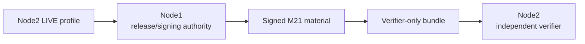

# M21 — Embedded Linux & Platform Security Validation

M21 extends the M0–M20 governance, security, bounded-agent, CRA-evidence, cross-node validation, and final-freeze chain into demonstrable platform-security evidence for Linux/embedded/server-class systems.

## Scope

M21 covers:

- Node1 BIOS/UEFI-oriented boot-chain evidence;
- Jetson-style BootROM → MB1 → MB2 → UEFI boot-chain evidence;
- Secure Boot and kernel-lockdown observation;
- BMC/device-firmware capability/inventory evidence;
- synthetic firmware signing and payload verification;
- monotonic rollback-counter decisions;
- debug-control sysctls;
- Linux least-privilege/systemd isolation reference controls;
- AppArmor/SELinux capability and enforcement evidence;
- TPM device/usability/PCR evidence;
- clearly separated DICE software demonstration vs hardware claim;
- signed platform-security manifest and verifier-only packaging;
- platform threat model and CI gates.

## Safety boundary

M21 acceptance is non-destructive. It does **not**:

- burn fuses;
- enroll UEFI keys;
- flash firmware;
- alter debug fuses;
- install or force-enable MAC policy;
- reconfigure the host merely to satisfy a check;
- claim CRA conformity.

LIVE collectors observe current state. Synthetic firmware is used for signing/rollback demonstrations.

## Node roles



**Node1** captures its LIVE platform profile, combines it with the Node2 profile, generates and signs M21 material, and packages verifier-only evidence.

**Node2** captures its LIVE profile and independently verifies the public/verifier material. Node2 must reject private signing material.

## Boot-chain model

Node1:

```text
hardware / platform firmware
  → UEFI
  → shim / GRUB
  → kernel
  → initramfs
  → root filesystem
  → systemd services
```

Node2:

```text
BootROM / fuses
  → MB1
  → MB2
  → UEFI
  → kernel / DTB / initrd
  → root filesystem
  → systemd services
```

These models describe the validation evidence chain; they do not by themselves prove that Secure Boot is enabled.

## Root-of-trust evidence

TPM collection distinguishes:

- device presence;
- actual tool/device usability;
- PCR readability.

DICE evidence has two distinct meanings:

- `DEMONSTRATION_ONLY` software derivation for semantics/testing;
- explicit hardware capability evidence when a platform can support such a claim.

Software DICE output is never presented as hardware DICE evidence.

## Source and baseline provenance

M21 v0.21.1 signs provenance using separate fields:

| Field | Meaning |
|---|---|
| `m20_baseline_commit` | immutable M20 source baseline |
| `m20_baseline_tag` | immutable M20 release identity |
| `m21_source_commit` | exact M21 source revision used to generate evidence |

This corrects the v0.21.0 ambiguity that compared an M20-named field directly to the current repository HEAD.

## Current validated LIVE result

The preserved M21 v0.21.1 evidence in the reviewed release snapshot reports:

- 15 required checks passed;
- 2 required checks open;
- `production_ready=false`;
- `cra_conformity_claim=false`.

Open checks:

1. **Secure Boot** — not enabled on the validated Node1/Node2 baseline.
2. **Enforcing MAC on Node2** — no enforcing MAC baseline is currently demonstrated. SELinux is intentionally left disabled on the stable validated Jetson baseline after the attempted permissive configuration caused a boot failure.

These are platform-hardening gaps, not reasons to falsify the verifier result.

## Reference implementation paths

```text
src/portable_ai_governance/platform_security/
governance/platform/m21/
schemas/m21/
scripts/m21/
deploy/m21/
examples/m21/
tests/platform_security/
```

## Related documentation

- [`Prerequisites-M21.md`](Prerequisites-M21.md)
- [`Deployment-M21.md`](Deployment-M21.md)
- [`Validation-M21.md`](Validation-M21.md)
- [`Architecture.md`](Architecture.md)
- [`Validation.md`](Validation.md)


### M22 relationship

This document remains authoritative for its historical milestone scope. M22 does not rewrite that milestone; it inventories and maps its reusable controls/evidence into the enterprise-security foundation and records remaining gaps in `governance/enterprise/m22/gap-register.json`. See `docs/M22-CISSP-Enterprise-Security-Control-Foundation.md`.

## M23 relationship

This historical milestone document remains authoritative for its original scope. M23 does not rewrite it; M23 consumes the existing identity/authorization/evidence lineage and adds enterprise federation, strong/phishing-resistant MFA policy, entitlement review, PAM/JIT, break-glass, segregation-of-duties, and Node1/Node2 verifier evidence. See `docs/M23-Enterprise-Identity-MFA-PAM.md`.

## M24 relationship

M24 extends the frozen M23 baseline with deterministic asset inventory/ownership/classification, retention and legal-hold handling, evidence-backed sanitization, default-deny DLP/controlled export, and cryptographic key-lifecycle evidence. This historical document remains authoritative for its original milestone; M24 consumes its reusable evidence but does not rewrite M0-M23 semantics. See `docs/M24-Asset-Security-Data-Protection-Crypto-Lifecycle.md`, `docs/Prerequisites-M24.md`, `docs/Deployment-M24.md`, and `docs/Validation-M24.md`. M24 closes only `CISSP-D2-001..003`; M21-dependent Domain-3 platform/hardware-root gaps remain open.

## M25 relationship

M25 extends the frozen M24 baseline with explicit network zones, default-deny micro-segmentation, mTLS workload-identity binding, egress allowlisting, network-detection policy and deterministic firewall evidence. This historical document remains authoritative for its original milestone; M25 consumes reusable evidence without rewriting M0-M24 semantics. See `docs/M25-Zero-Trust-Network-Microsegmentation.md`, `docs/Prerequisites-M25.md`, `docs/Deployment-M25.md`, and `docs/Validation-M25.md`. M25 closes the M22 `CISSP-D4-002` engineering gap while physical switch/VLAN enforcement and M26 SOC/DR integration remain environment/future-scope evidence.
## M26 relationship

M26 adds the enterprise operational-security evidence layer for centralized SOC telemetry/correlation, vulnerability-remediation operations, executable incident response, and immutable backup/restore/DR validation. This document retains its original milestone authority; M26 consumes its established controls/evidence without rewriting historical behavior. See `docs/M26-SOC-Vulnerability-Incident-Backup-DR.md`, `docs/Prerequisites-M26.md`, `docs/Deployment-M26.md`, and `docs/Validation-M26.md`.

## M27 relationship

M27 adds the Secure SDLC / DevSecOps / AppSec evidence layer on top of the immutable M0–M26 lineage. This document keeps its original milestone authority; M27 consumes its controls/evidence where relevant and does not retroactively rewrite the historical contract. M27 closes the `CISSP-D6-002` control-plane capability gap with default-deny security testing gates and independently verifiable Node1/Node2 evidence. Simulated local penetration-test evidence validates the workflow only and is not a production penetration-test claim.

## M28 relationship

M28 adds authority-bound evidence controls for organizational governance, personnel security/training, physical/environmental security, and business-continuity exercises. This document keeps its original milestone authority; M28 consumes its applicable evidence without rewriting historical M0–M27 claims. Real-world HR/facility/BCP controls require authorized production records—local Python validation proves the evidence contract, signatures, freshness and source binding only.

## M29 relationship

M29 aggregates the signed M21 platform prerequisite and M22–M28 enterprise-security evidence into one cross-domain Node1/Node2 validation package. This historical document remains authoritative for its original milestone; M29 consumes its evidence without rewriting its semantics. M29 distinguishes evidence-integrity success from production readiness and remains fail-closed while M21 platform controls or real M27/M28 production evidence are outstanding. See `docs/M29-Enterprise-Cross-Domain-Node1-Node2-Validation.md`, `docs/Prerequisites-M29.md`, `docs/Deployment-M29.md`, and `docs/Validation-M29.md`.
