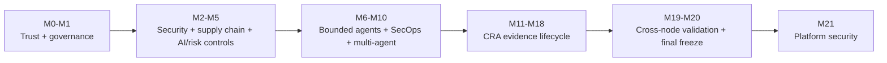

# Milestones

This document is the compact release map. Feature-specific design details remain in the corresponding milestone documents.

## Current development state

**M25 — Zero-Trust Network & Micro-segmentation**

Latest immutable tagged baseline: **M24 v0.24.0**

Tag: `m24-asset-security-data-lifecycle-v0.24.0`

Commit: `62a1713ff468117cefc256c03d2a71f26928f8cc`

M25 remains a development milestone until physical Node1/Node2 verification, final regression, commit and release tagging are complete.

## Milestone matrix

| Milestone | Status in current history | Primary capability |
|---|---|---|
| M0–M1 | Frozen baseline | deterministic trust kernel + governance foundation |
| M2 | Implemented/validated | identity, RBAC/ABAC, mTLS, secrets, signing, anti-replay, audit, rate limits |
| M3 | Implemented/validated | software/model supply-chain evidence and vulnerability policy |
| M4 | Implemented/validated | model/data/RAG/embedding/evaluation/threat-model security controls |
| M5 | Implemented/validated | impact, privacy, exceptions, third parties, continuous controls, compliance reporting |
| M6 | Implemented/validated | bounded read-only Evidence Analyst |
| M7 | Implemented/validated | mediated typed-tool agent |
| M8 | Implemented/validated | independently approved bounded side effects |
| M9 | Implemented/validated | deterministic security operations and recovery evidence |
| M10 | Implemented | supervised multi-agent governance workflow with signed human disposition |
| M11 | Implemented | CRA product-security foundation and requirement matrix |
| M12 | Implemented | vulnerability/exploitation intelligence |
| M13 | Implemented | severe-incident classification and statutory-clock evidence |
| M14 | Implemented | reporting / ENISA SRP evidence-pack preparation |
| M15 | Implemented | PSIRT, CVD, advisory, and user-notification preparation |
| M16 | Implemented | secure-update and product-lifecycle evidence |
| M17 | Implemented | CRA Annex-I evidence index/gap model |
| M18 | Implemented | CRA Annex-VII technical-file evidence assembly |
| M19 | Implemented | Node1/Node2 production-validation evidence chain |
| M20 | Implemented | enterprise deployment/final-freeze evidence and secure-agentic demonstration |
| M21 | Implemented/tagged | embedded Linux/platform-security validation and signed provenance correction |
| M22 | Implemented/tagged | enterprise-security/CISSP-domain foundation and gap registry |
| M23 | Implemented/tagged | enterprise identity, MFA and PAM |
| M24 | Implemented/tagged | asset security, data protection, DLP and cryptographic/data lifecycle |
| M25 | **Current development** | zero-trust network zoning, micro-segmentation, egress and detection evidence |

## Evolution

## Current M21 release notes

M21 v0.21.0 added platform-security collection/evaluation, signed firmware descriptor and rollback demonstrations, TPM/DICE evidence boundaries, systemd/MAC reference controls, platform threat modeling, CI, and Node1/Node2 verifier workflows.

M21 v0.21.1 corrected release provenance by separating:

- immutable M20 baseline commit;
- immutable M20 baseline tag;
- M21 evidence-generation source commit.

The corrected verifier checks baseline existence/ancestry/tag identity and M21 source existence/lineage.

The validated LIVE platform result remains 15 PASS / 2 open required checks with `production_ready=false`.

## M22 enterprise-security extension

M22 extends the frozen M21.1 baseline with the authoritative CISSP-domain / enterprise-security control foundation. See `docs/M22-CISSP-Enterprise-Security-Control-Foundation.md`, `docs/Prerequisites-M22.md`, `docs/Deployment-M22.md`, and `docs/Validation-M22.md`. M0–M21 historical behavior remains unchanged; M22 records alignment and gaps and does not assert CISSP, ISO/IEC 27001, ISO/IEC 42001, or CRA certification/conformity.

### M22 relationship

This document remains authoritative for its historical milestone scope. M22 does not rewrite that milestone; it inventories and maps its reusable controls/evidence into the enterprise-security foundation and records remaining gaps in `governance/enterprise/m22/gap-register.json`. See `docs/M22-CISSP-Enterprise-Security-Control-Foundation.md`.

## M23 relationship

M23 extends the frozen M22 enterprise-security foundation with enterprise human identity, OIDC federation evidence, strong MFA context, phishing-resistant privileged authentication, expiring entitlement review, signed single-use JIT privilege grants, dual-approved break-glass access, segregation of duties, and independent Node1/Node2 verification. The authoritative M23 documents are `docs/M23-Enterprise-Identity-MFA-PAM.md`, `docs/Prerequisites-M23.md`, `docs/Deployment-M23.md`, and `docs/Validation-M23.md`. Historical M0-M22 behavior and evidence remain immutable.

## M24 relationship

M24 extends the frozen M23 baseline with deterministic asset inventory/ownership/classification, retention and legal-hold handling, evidence-backed sanitization, default-deny DLP/controlled export, and cryptographic key-lifecycle evidence. This historical document remains authoritative for its original milestone; M24 consumes its reusable evidence but does not rewrite M0-M23 semantics. See `docs/M24-Asset-Security-Data-Protection-Crypto-Lifecycle.md`, `docs/Prerequisites-M24.md`, `docs/Deployment-M24.md`, and `docs/Validation-M24.md`. M24 closes only `CISSP-D2-001..003`; M21-dependent Domain-3 platform/hardware-root gaps remain open.

## M24 development milestone

**M24 — Asset Security, Data Protection & Cryptographic/Data Lifecycle** builds on tagged M23. It implements the M22 Domain-2 gap closures through deterministic controls and independent evidence verification. The latest immutable tagged release remains M23 until physical Node1/Node2 validation, commit, regression, and tag completion.

## M25 relationship

M25 extends the frozen M24 baseline with explicit network zones, default-deny micro-segmentation, mTLS workload-identity binding, egress allowlisting, network-detection policy and deterministic firewall evidence. This historical document remains authoritative for its original milestone; M25 consumes reusable evidence without rewriting M0-M24 semantics. See `docs/M25-Zero-Trust-Network-Microsegmentation.md`, `docs/Prerequisites-M25.md`, `docs/Deployment-M25.md`, and `docs/Validation-M25.md`. M25 closes the M22 `CISSP-D4-002` engineering gap while physical switch/VLAN enforcement and M26 SOC/DR integration remain environment/future-scope evidence.
## M26 relationship

M26 adds the enterprise operational-security evidence layer for centralized SOC telemetry/correlation, vulnerability-remediation operations, executable incident response, and immutable backup/restore/DR validation. This document retains its original milestone authority; M26 consumes its established controls/evidence without rewriting historical behavior. See `docs/M26-SOC-Vulnerability-Incident-Backup-DR.md`, `docs/Prerequisites-M26.md`, `docs/Deployment-M26.md`, and `docs/Validation-M26.md`.
