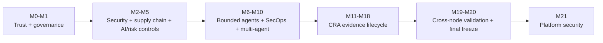

# Milestones

This document is the compact release map. Feature-specific design details remain in the corresponding milestone documents.

## Current release

**M21 v0.21.1 — Embedded Linux & Platform Security Validation**

Tag: `m21-embedded-linux-platform-security-v0.21.1`

Commit: `e83ebf03c6d1ce2f4076ab8e3dae8282e4aeb880`

## Milestone matrix

| Milestone | Status in current history | Primary capability |
|---|---|---|
| M0–M1 | Frozen baseline | deterministic trust kernel + governance foundation |
| M2 | Implemented/validated | identity, RBAC/ABAC, mTLS, secrets, signing, anti-replay, audit, rate limits |
| M3 | Implemented/validated | software/model supply-chain evidence and vulnerability policy |
| M4 | Implemented/validated | model/data/RAG/embedding/evaluation/threat-model security controls |
| M5 | Implemented/validated | impact, privacy, exceptions, third parties, continuous controls, compliance reporting |
| M6 | Implemented/validated | bounded read-only Evidence Analyst |
| M7 | Implemented/validated | mediated typed-tool agent |
| M8 | Implemented/validated | independently approved bounded side effects |
| M9 | Implemented/validated | deterministic security operations and recovery evidence |
| M10 | Implemented | supervised multi-agent governance workflow with signed human disposition |
| M11 | Implemented | CRA product-security foundation and requirement matrix |
| M12 | Implemented | vulnerability/exploitation intelligence |
| M13 | Implemented | severe-incident classification and statutory-clock evidence |
| M14 | Implemented | reporting / ENISA SRP evidence-pack preparation |
| M15 | Implemented | PSIRT, CVD, advisory, and user-notification preparation |
| M16 | Implemented | secure-update and product-lifecycle evidence |
| M17 | Implemented | CRA Annex-I evidence index/gap model |
| M18 | Implemented | CRA Annex-VII technical-file evidence assembly |
| M19 | Implemented | Node1/Node2 production-validation evidence chain |
| M20 | Implemented | enterprise deployment/final-freeze evidence and secure-agentic demonstration |
| M21 | **Current — v0.21.1** | embedded Linux/platform-security validation and signed provenance correction |

## Evolution

## Current M21 release notes

M21 v0.21.0 added platform-security collection/evaluation, signed firmware descriptor and rollback demonstrations, TPM/DICE evidence boundaries, systemd/MAC reference controls, platform threat modeling, CI, and Node1/Node2 verifier workflows.

M21 v0.21.1 corrected release provenance by separating:

- immutable M20 baseline commit;
- immutable M20 baseline tag;
- M21 evidence-generation source commit.

The corrected verifier checks baseline existence/ancestry/tag identity and M21 source existence/lineage.

The validated LIVE platform result remains 15 PASS / 2 open required checks with `production_ready=false`.
