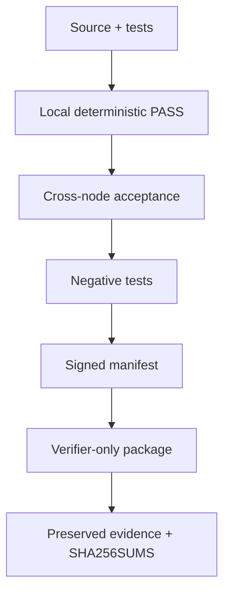

# Validation Architecture

Validation is the mechanism that turns repository claims into reproducible evidence. This document defines the common validation layers; milestone-specific files such as `Validation-M21.md` provide concrete gates.

## Validation principles

- A skipped check is not a PASS.
- Fixture/simulated validation proves deterministic logic, not LIVE platform readiness.
- A verifier PASS proves evidence integrity and policy satisfaction for that verifier contract; it does not erase open platform hardening gaps.
- Negative tests are first-class acceptance evidence.
- Release claims must be traceable to executable tests, source identity, and signed/digest-bound artifacts.

## V1 — Environment qualification

Confirm the execution environment before evaluating the product logic.

Typical evidence:

- OS and architecture;
- Python version;
- required commands and libraries;
- file-system permissions;
- Node role;
- network assumptions;
- hardware/security-device visibility where relevant.

M21 additionally captures boot/security capability information such as UEFI/Secure Boot indicators, Jetson platform information, TPM device/tooling state, and MAC capability.

## V2 — Configuration and policy qualification

Confirm that configuration inputs are internally consistent and fail closed where required.

Examples:

- JSON policy/schema parseability;
- Node-role contracts;
- production-vs-lab security profile;
- independent signing-key domains;
- milestone baseline/source identities;
- non-destructive safety boundaries.

## V3 — Tools, syntax, and static contracts

Confirm source and reference artifacts can be parsed or validated by the relevant local tools.

Examples:

```bash
python3 -m compileall -q src
python3 -m pytest -q <focused-tests>
python3 -m json.tool <policy.json>
git diff --check
```

M21 CI also checks the reference systemd unit and, when available, AppArmor profile syntax.

Tool absence must be reported accurately; it must not be converted into an enforcement claim.

## V4 — Local deterministic validation

Execute the milestone logic with deterministic fixtures or local material.

For M21:

```bash
./scripts/m21/validate_m21_local.sh
./scripts/m21/ci_validate.sh
```

This layer proves material generation, signature/digest verification, policy checks, and verifier-only packaging logic using simulated profiles. It does not prove both physical nodes satisfy LIVE production-hardening policy.

## V5 — Cross-node and milestone acceptance

Exercise the trust split and the full milestone regression chain.

For M21 this includes:

- Node2 LIVE profile capture;
- Node1 LIVE profile capture and signing authority;
- verifier-only package construction;
- Node2 independent verification;
- firmware tamper rejection;
- private-key injection rejection;
- Node1/Node2 source identity/parity checks;
- M0–M21 regression.

The complete local regression entry point is:

```bash
./scripts/m21/validate_m21_regression.sh
```

## V6 — Signed release and evidence package

The release layer binds the executable result to source and milestone provenance.

For M21 v0.21.1, the signed manifest records:

- `m20_baseline_commit`;
- `m20_baseline_tag`;
- `m21_source_commit`;
- SHA-256 digests of protected artifacts;
- non-destructive boundary flags.

Release evidence should be preserved with a checksum manifest and must exclude private signing material from verifier/public evidence sets.



## Current M21 v0.21.1 LIVE result

The preserved LIVE evidence in the reviewed source snapshot reports:

| Field | Result |
|---|---|
| `validation_mode` | `LIVE` |
| Passed required checks | 15 |
| Failed/open required checks | 2 |
| `production_ready` | `false` |
| `cra_conformity_claim` | `false` |

Open checks:

- `secure-boot-enabled`;
- `mac-enforcing`.

These open checks are part of the evidence, not documentation defects to be hidden.

## Troubleshooting rule

When validation fails, identify the failing layer first:

1. environment;
2. configuration;
3. tool/static contract;
4. local deterministic logic;
5. cross-node/release acceptance;
6. evidence packaging/provenance.

Fix the cause at that layer and rerun downstream layers. Do not edit expected results merely to make the gate green.


## M22 enterprise-security extension

M22 extends the frozen M21.1 baseline with the authoritative CISSP-domain / enterprise-security control foundation. See `docs/M22-CISSP-Enterprise-Security-Control-Foundation.md`, `docs/Prerequisites-M22.md`, `docs/Deployment-M22.md`, and `docs/Validation-M22.md`. M0–M21 historical behavior remains unchanged; M22 records alignment and gaps and does not assert CISSP, ISO/IEC 27001, ISO/IEC 42001, or CRA certification/conformity.


### M22 relationship

This document remains authoritative for its historical milestone scope. M22 does not rewrite that milestone; it inventories and maps its reusable controls/evidence into the enterprise-security foundation and records remaining gaps in `governance/enterprise/m22/gap-register.json`. See `docs/M22-CISSP-Enterprise-Security-Control-Foundation.md`.

## M23 relationship

M23 extends the frozen M22 enterprise-security foundation with enterprise human identity, OIDC federation evidence, strong MFA context, phishing-resistant privileged authentication, expiring entitlement review, signed single-use JIT privilege grants, dual-approved break-glass access, segregation of duties, and independent Node1/Node2 verification. The authoritative M23 documents are `docs/M23-Enterprise-Identity-MFA-PAM.md`, `docs/Prerequisites-M23.md`, `docs/Deployment-M23.md`, and `docs/Validation-M23.md`. Historical M0-M22 behavior and evidence remain immutable.

## M24 relationship

M24 extends the frozen M23 baseline with deterministic asset inventory/ownership/classification, retention and legal-hold handling, evidence-backed sanitization, default-deny DLP/controlled export, and cryptographic key-lifecycle evidence. This historical document remains authoritative for its original milestone; M24 consumes its reusable evidence but does not rewrite M0-M23 semantics. See `docs/M24-Asset-Security-Data-Protection-Crypto-Lifecycle.md`, `docs/Prerequisites-M24.md`, `docs/Deployment-M24.md`, and `docs/Validation-M24.md`. M24 closes only `CISSP-D2-001..003`; M21-dependent Domain-3 platform/hardware-root gaps remain open.

## M25 relationship

M25 extends the frozen M24 baseline with explicit network zones, default-deny micro-segmentation, mTLS workload-identity binding, egress allowlisting, network-detection policy and deterministic firewall evidence. This historical document remains authoritative for its original milestone; M25 consumes reusable evidence without rewriting M0-M24 semantics. See `docs/M25-Zero-Trust-Network-Microsegmentation.md`, `docs/Prerequisites-M25.md`, `docs/Deployment-M25.md`, and `docs/Validation-M25.md`. M25 closes the M22 `CISSP-D4-002` engineering gap while physical switch/VLAN enforcement and M26 SOC/DR integration remain environment/future-scope evidence.
## M26 relationship

M26 adds the enterprise operational-security evidence layer for centralized SOC telemetry/correlation, vulnerability-remediation operations, executable incident response, and immutable backup/restore/DR validation. This document retains its original milestone authority; M26 consumes its established controls/evidence without rewriting historical behavior. See `docs/M26-SOC-Vulnerability-Incident-Backup-DR.md`, `docs/Prerequisites-M26.md`, `docs/Deployment-M26.md`, and `docs/Validation-M26.md`.
