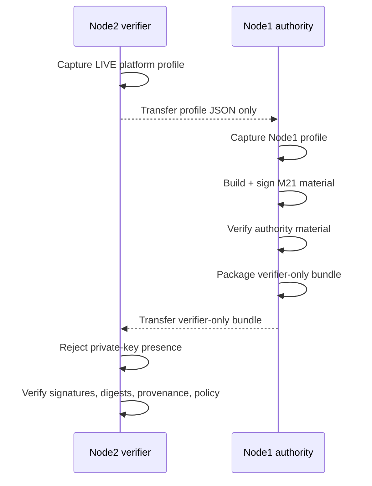

# Progressive One-Shot Deployment Contract

The repository already contains milestone-scoped `one_shot_node1.sh` and `one_shot_node2.sh` workflows. A universal top-level installer is a future integration target, not a current claim.

## Target interface

The intended repository-level contract is eventually:

```text
./deploy.sh --node1
./deploy.sh --node2
./deploy.sh --all
./deploy.sh --verify
./deploy.sh --rollback
```

The implementation must be idempotent, evidence-producing, fail closed, and explicit about irreversible operations.

## Contract by operation

### `--node1`

Expected responsibilities:

- validate prerequisites;
- establish authority-side runtime directories;
- generate or consume milestone inputs;
- generate signed evidence material;
- retain private signing material only in the authority domain;
- run Node1 verification;
- produce verifier-only material.

### `--node2`

Expected responsibilities:

- validate verifier prerequisites;
- reject private signing material;
- install only verifier-safe material;
- validate signatures, digests, source/baseline provenance, and policy;
- produce PASS/FAIL evidence without obtaining signing authority.

### `--all`

Expected responsibilities:

- orchestrate `--node1` and `--node2` in the correct dependency order;
- preserve transport/source parity evidence;
- stop on any failed authority/verifier gate.

It must not silently collapse Node1 and Node2 trust roles into one authority domain.

### `--verify`

Expected responsibilities:

- perform non-mutating verification of installed material;
- verify source/tag/baseline identities where applicable;
- verify signed manifests and artifact digests;
- report open hardening gaps separately from evidence-integrity failures.

### `--rollback`

Expected responsibilities:

- restore the last known-good **software/evidence deployment state** when a reversible deployment step exists;
- never imply that irreversible firmware/fuse operations can be rolled back by a generic script;
- preserve rollback evidence and operator intent.

## Idempotency requirements

A mature one-shot workflow should:

1. detect current state before modifying it;
2. avoid regenerating authority material unnecessarily;
3. preserve or rotate keys only under an explicit policy;
4. use restrictive permissions;
5. verify after every materialization step;
6. reject unsafe destinations and authority mixing;
7. leave sufficient evidence to explain what changed.

## Current M21 mapping

M21 currently implements the core role-specific building blocks:

```text
deploy/m21/one_shot_node1.sh
deploy/m21/one_shot_node2.sh
deploy/m21/deploy_node.sh
deploy/m21/package_verifier_material.sh
scripts/m21/verify_node1.sh
scripts/m21/verify_node2.sh
```



M21 deployment is intentionally non-destructive with respect to platform firmware/security configuration. It does not burn fuses, enroll UEFI keys, flash firmware, or install MAC policy.
