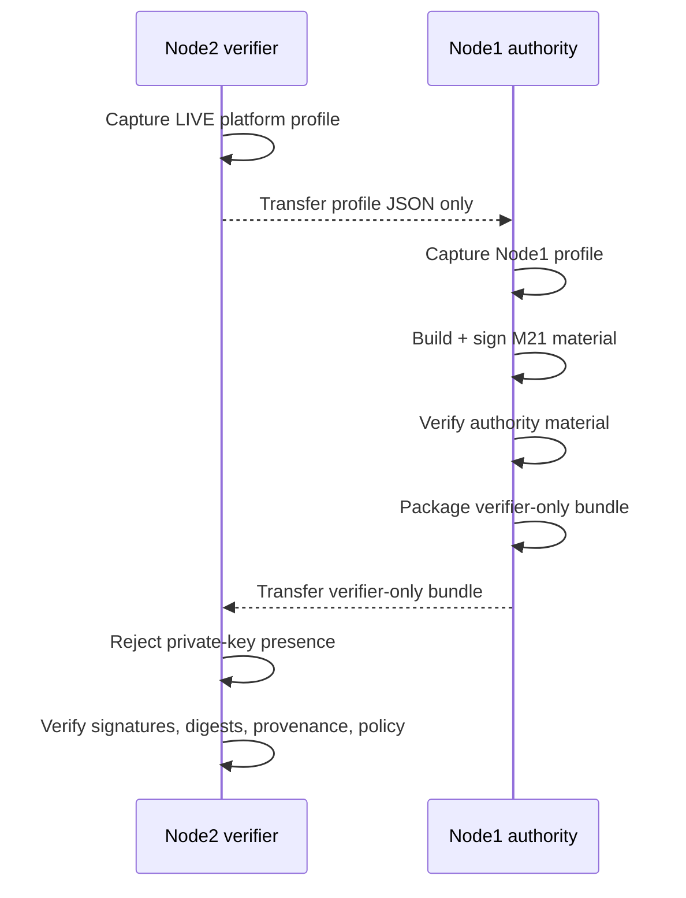

> Current development milestone: **M27 — Secure SDLC / DevSecOps / AppSec**. Latest immutable tagged parent: **M26 v0.26.0**.

# Progressive One-Shot Deployment Contract

The repository already contains milestone-scoped `one_shot_node1.sh` and `one_shot_node2.sh` workflows. A universal top-level installer is a future integration target, not a current claim.

## Target interface

The intended repository-level contract is eventually:

```text
./deploy.sh --node1
./deploy.sh --node2
./deploy.sh --all
./deploy.sh --verify
./deploy.sh --rollback
```

The implementation must be idempotent, evidence-producing, fail closed, and explicit about irreversible operations.

## Contract by operation

### `--node1`

Expected responsibilities:

- validate prerequisites;
- establish authority-side runtime directories;
- generate or consume milestone inputs;
- generate signed evidence material;
- retain private signing material only in the authority domain;
- run Node1 verification;
- produce verifier-only material.

### `--node2`

Expected responsibilities:

- validate verifier prerequisites;
- reject private signing material;
- install only verifier-safe material;
- validate signatures, digests, source/baseline provenance, and policy;
- produce PASS/FAIL evidence without obtaining signing authority.

### `--all`

Expected responsibilities:

- orchestrate `--node1` and `--node2` in the correct dependency order;
- preserve transport/source parity evidence;
- stop on any failed authority/verifier gate.

It must not silently collapse Node1 and Node2 trust roles into one authority domain.

### `--verify`

Expected responsibilities:

- perform non-mutating verification of installed material;
- verify source/tag/baseline identities where applicable;
- verify signed manifests and artifact digests;
- report open hardening gaps separately from evidence-integrity failures.

### `--rollback`

Expected responsibilities:

- restore the last known-good **software/evidence deployment state** when a reversible deployment step exists;
- never imply that irreversible firmware/fuse operations can be rolled back by a generic script;
- preserve rollback evidence and operator intent.

## Idempotency requirements

A mature one-shot workflow should:

1. detect current state before modifying it;
2. avoid regenerating authority material unnecessarily;
3. preserve or rotate keys only under an explicit policy;
4. use restrictive permissions;
5. verify after every materialization step;
6. reject unsafe destinations and authority mixing;
7. leave sufficient evidence to explain what changed.

## Current M21 mapping

M21 currently implements the core role-specific building blocks:

```text
deploy/m21/one_shot_node1.sh
deploy/m21/one_shot_node2.sh
deploy/m21/deploy_node.sh
deploy/m21/package_verifier_material.sh
scripts/m21/verify_node1.sh
scripts/m21/verify_node2.sh
```



M21 deployment is intentionally non-destructive with respect to platform firmware/security configuration. It does not burn fuses, enroll UEFI keys, flash firmware, or install MAC policy.


## M22 enterprise-security extension

M22 extends the frozen M21.1 baseline with the authoritative CISSP-domain / enterprise-security control foundation. See `docs/M22-CISSP-Enterprise-Security-Control-Foundation.md`, `docs/Prerequisites-M22.md`, `docs/Deployment-M22.md`, and `docs/Validation-M22.md`. M0–M21 historical behavior remains unchanged; M22 records alignment and gaps and does not assert CISSP, ISO/IEC 27001, ISO/IEC 42001, or CRA certification/conformity.


### M22 relationship

This document remains authoritative for its historical milestone scope. M22 does not rewrite that milestone; it inventories and maps its reusable controls/evidence into the enterprise-security foundation and records remaining gaps in `governance/enterprise/m22/gap-register.json`. See `docs/M22-CISSP-Enterprise-Security-Control-Foundation.md`.

## M23 relationship

M23 extends the frozen M22 enterprise-security foundation with enterprise human identity, OIDC federation evidence, strong MFA context, phishing-resistant privileged authentication, expiring entitlement review, signed single-use JIT privilege grants, dual-approved break-glass access, segregation of duties, and independent Node1/Node2 verification. The authoritative M23 documents are `docs/M23-Enterprise-Identity-MFA-PAM.md`, `docs/Prerequisites-M23.md`, `docs/Deployment-M23.md`, and `docs/Validation-M23.md`. Historical M0-M22 behavior and evidence remain immutable.

## M24 relationship

M24 extends the frozen M23 baseline with deterministic asset inventory/ownership/classification, retention and legal-hold handling, evidence-backed sanitization, default-deny DLP/controlled export, and cryptographic key-lifecycle evidence. This historical document remains authoritative for its original milestone; M24 consumes its reusable evidence but does not rewrite M0-M23 semantics. See `docs/M24-Asset-Security-Data-Protection-Crypto-Lifecycle.md`, `docs/Prerequisites-M24.md`, `docs/Deployment-M24.md`, and `docs/Validation-M24.md`. M24 closes only `CISSP-D2-001..003`; M21-dependent Domain-3 platform/hardware-root gaps remain open.

## M25 relationship

M25 extends the frozen M24 baseline with explicit network zones, default-deny micro-segmentation, mTLS workload-identity binding, egress allowlisting, network-detection policy and deterministic firewall evidence. This historical document remains authoritative for its original milestone; M25 consumes reusable evidence without rewriting M0-M24 semantics. See `docs/M25-Zero-Trust-Network-Microsegmentation.md`, `docs/Prerequisites-M25.md`, `docs/Deployment-M25.md`, and `docs/Validation-M25.md`. M25 closes the M22 `CISSP-D4-002` engineering gap while physical switch/VLAN enforcement and M26 SOC/DR integration remain environment/future-scope evidence.
## M26 relationship

M26 adds the enterprise operational-security evidence layer for centralized SOC telemetry/correlation, vulnerability-remediation operations, executable incident response, and immutable backup/restore/DR validation. This document retains its original milestone authority; M26 consumes its established controls/evidence without rewriting historical behavior. See `docs/M26-SOC-Vulnerability-Incident-Backup-DR.md`, `docs/Prerequisites-M26.md`, `docs/Deployment-M26.md`, and `docs/Validation-M26.md`.

## M27 relationship

M27 adds the Secure SDLC / DevSecOps / AppSec evidence layer on top of the immutable M0–M26 lineage. This document keeps its original milestone authority; M27 consumes its controls/evidence where relevant and does not retroactively rewrite the historical contract. M27 closes the `CISSP-D6-002` control-plane capability gap with default-deny security testing gates and independently verifiable Node1/Node2 evidence. Simulated local penetration-test evidence validates the workflow only and is not a production penetration-test claim.

## M28 relationship

M28 adds authority-bound evidence controls for organizational governance, personnel security/training, physical/environmental security, and business-continuity exercises. This document keeps its original milestone authority; M28 consumes its applicable evidence without rewriting historical M0–M27 claims. Real-world HR/facility/BCP controls require authorized production records—local Python validation proves the evidence contract, signatures, freshness and source binding only.

## M29 relationship

M29 aggregates the signed M21 platform prerequisite and M22–M28 enterprise-security evidence into one cross-domain Node1/Node2 validation package. This historical document remains authoritative for its original milestone; M29 consumes its evidence without rewriting its semantics. M29 distinguishes evidence-integrity success from production readiness and remains fail-closed while M21 platform controls or real M27/M28 production evidence are outstanding. See `docs/M29-Enterprise-Cross-Domain-Node1-Node2-Validation.md`, `docs/Prerequisites-M29.md`, `docs/Deployment-M29.md`, and `docs/Validation-M29.md`.
